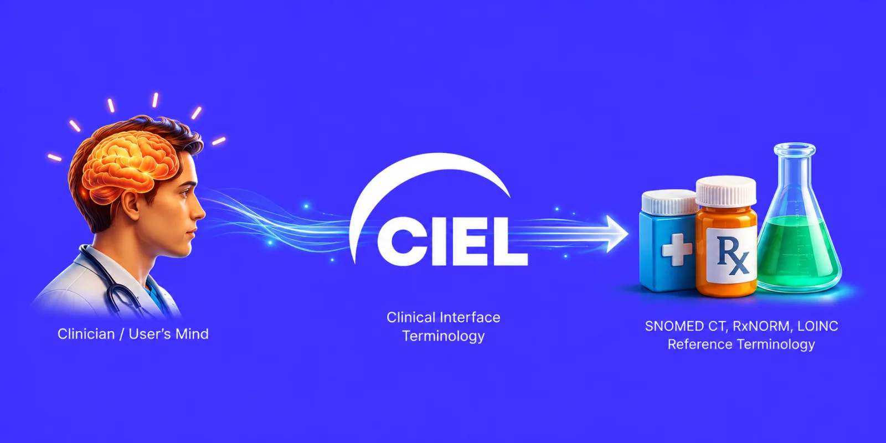

  

# CIEL Terminology

The **Columbia International eHealth Laboratory (CIEL) Terminology** is an open source, standardized clinical interface terminology used particularly by low- and middle-income countries (LMICs) to capture, map, and analyze health information.

CIEL sits between the language clinicians use at the point of care and the reference terminologies used for interoperability, reporting and research, such as SNOMED CT, ICD-10, ICD-11, RxNorm, ATC, LOINC, CVX and OMOP.

| | |
|---|---|
| **Concepts** | 55,545 active |
| **Mappings** | 333,362 active |
| **Locales** | 23 (5 with more than 95% coverage) |
| **Releases** | Monthly, managed entirely in [Open Concept Lab](https://openconceptlab.org/) |
| **License** | [CC BY 4.0](LICENSE) |

_Figures from the HEAD version, October 2026._

## Documentation

**Everything you need to use, contribute to and understand CIEL is in the [Wiki](https://github.com/CIEL-Terminology/readme/wiki).**

## Get started

- **Browse the terminology:** [app.v3.openconceptlab.org](https://app.v3.openconceptlab.org/#/orgs/CIEL/)
- **Use CIEL in an EHR (OpenMRS):** [Using OCL for OpenMRS concept dictionary management](https://openconceptlab.org/blog/using-ocl-for-openmrs-concept-dictionary-management)
- **Use CIEL for mapping:** [map.openconceptlab.org](https://map.openconceptlab.org)
- **Manage and review CIEL content:** [CIEL Lab](https://ciellab.filipelopes.med.br/), our management platform, tightly integrated with OCL
- **Global Goods Guidebook:** [CIEL entry](https://www.globalgoodsguidebook.org/global-goods/ciel)

Access requires a free OCL account. There is no charge for CIEL content.

## Evolution and ecosystem

CIEL began as the shared concept dictionary of the OpenMRS community and grew into a broad clinical interface terminology. A local concept can be linked to CIEL and, through its network of mappings, reach one or more reference terminologies, keeping the clinical detail without losing standardized representations.

CIEL, OpenMRS and Open Concept Lab (OCL) are Digital Public Goods, and work alongside initiatives such as OpenHIE and OHDSI/OMOP. OCL is the open infrastructure used to manage, version, map, publish and consume CIEL.

## Continuous improvement, quality and AI

CIEL is not a static artifact. It is continuously reviewed and improved. AI-assisted tools, such as the OCL Mapper, help curators find and rank mapping candidates, but a human always reviews and decides. Systematic Quality Assurance keeps the terminology consistent, traceable and safe to use in clinical systems, reporting and research as it grows.

## License

CIEL is licensed under the [Creative Commons Attribution 4.0 International (CC BY 4.0)](LICENSE) license. Some codes from other terminologies mapped in CIEL may be subject to third-party rights, and no license to them is conveyed by CIEL's authors. See [Terms of use](https://github.com/CIEL-Terminology/readme/wiki/Governance) in the Wiki.
